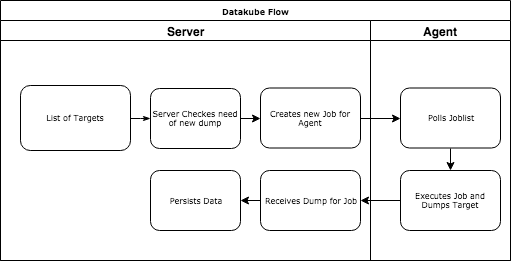

# Basics

## Concept
Let's take a look back at out Overview again:
> You might have already faced that situation: You happily deployed your set of services to a cloud of your choice 
  (e.g. Amazon RDS or Google Cloud SQL) and your nightly snapshots are running just fine. However, you might also want to
  have backups as simple SQL File Dumps to archive them somewhere else and have them accessible with your normal
  ecosytem.


Usually, the go to way is to write Shell Scripts like that:

```
#!/bin/sh

#----------------------------------------------------------
# a simple mysql database backup script.
# version 2, updated March 26, 2011.
# copyright 2011 alvin alexander, http://alvinalexander.com
#----------------------------------------------------------
# This work is licensed under a Creative Commons 
# Attribution-ShareAlike 3.0 Unported License;
# see http://creativecommons.org/licenses/by-sa/3.0/ 
# for more information.
#----------------------------------------------------------

# (1) set up all the mysqldump variables
FILE=minime.sql.`date +"%Y%m%d"`
DBSERVER=127.0.0.1
DATABASE=XXX
USER=XXX
PASS=XXX

# (2) in case you run this more than once a day, remove the previous version of the file
unalias rm     2> /dev/null
rm ${FILE}     2> /dev/null
rm ${FILE}.gz  2> /dev/null

# (3) do the mysql database backup (dump)

# use this command for a database server on a separate host:
#mysqldump --opt --protocol=TCP --user=${USER} --password=${PASS} --host=${DBSERVER} ${DATABASE} > ${FILE}

# use this command for a database server on localhost. add other options if need be.
mysqldump --opt --user=${USER} --password=${PASS} ${DATABASE} > ${FILE}

# (4) gzip the mysql database dump file
gzip $FILE

# (5) show the user the result
echo "${FILE}.gz was created:"
ls -l ${FILE}.gz
```
[taken from alvinalexander.com](https://alvinalexander.com/mysql/mysql-database-backup-dump-shell-script-crontab)

With the amount of services and therefore datasources you have, that may become hard to maintain and manage. So let's see
how datakube can assist on that matter


Let's check out how Datakube does things internally



- Server loads Targets from the (so far) File Backend and Lists them
- Every 60 seconds, he checks if a given Targets needs a new dump (given its schedule)
- If needed, it creates a new jobs and send it to the queue
- The Agent, polls regulary the jobs
- He fetches, one job from the queue and executes it
- Once finished successfully, he sends the dumped data back to the server
- The server takes the data and finally saves it

## Target
A [target](/configuration/target.md) is one "object" datakube should take care for. Currently, only SQL targets are supported. In Future, also file
or no-sql targets could get supported.

### Schedule
The schedule is the rhytm in which datakube should get dumps of this. For more info, see [target](/configuration/target.md) configuration.

## Job
A job is the object the agents pulls. A job is linked to a target and is some sort of history about what has been dumped yet.